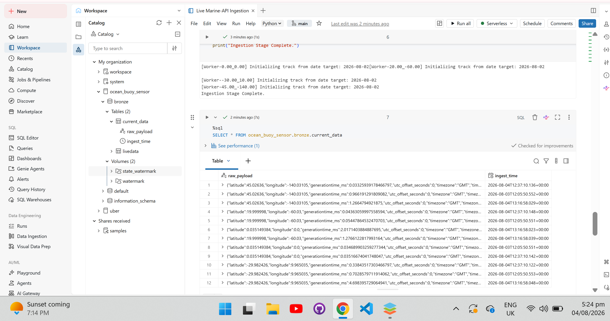
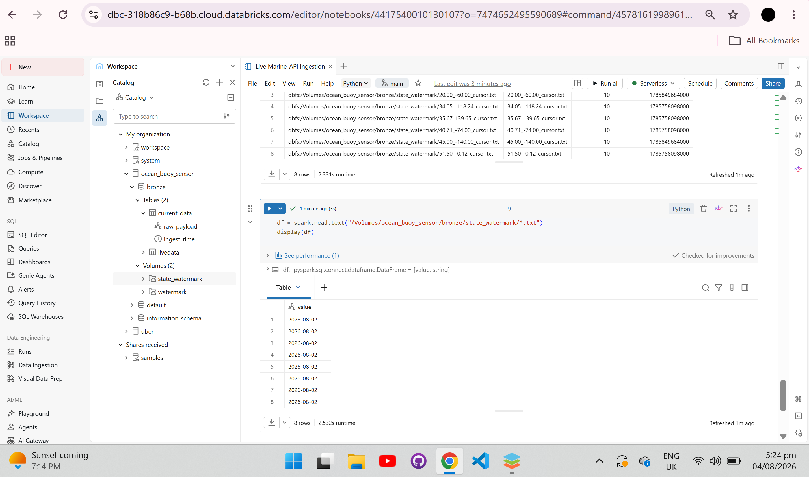

# IoT-Telemetry-Stateful-API-Ingestion-Python

This project contains a Python ingestion notebook built inside Databricks to fetch live marine weather and ocean data using real-world engineering practices. It connects to the public Open-Meteo API to mimic real-world ocean buoy sensor streams.

## What Data Are We Fetching and From Where?
The script pulls live marine weather data (Surface Temperature and Wind Speed) directly from the **Open-Meteo Forecast API**. 

Instead of downloading everything in one slow request, I target **4 deep-ocean geographic locations (coordinates)** to simulate separate marine buoy fleets out in the sea:
* **0.00, 0.00** (Atlantic Ocean - Null Island)
* **20.00, -60.00** (North Atlantic Ocean)
* **-30.00, 10.00** (South Atlantic Ocean)
* **45.00, -140.00** (North Pacific Ocean)

## Ingestion Verification & Database Results
The pipeline compiles successfully on Databricks. Below is my code result screenshot showing multi-threaded raw JSON payloads landing securely inside managed table:

## How the Code Works (Step-by-Step)

### 1. Loop and Parallel Threads Together
I use a small `for` loop to look at our list of ocean coordinates and load their last saved timestamps. Then, we pass those coordinates into a **ThreadPoolExecutor**. This spins up **4 parallel threads** at the exact same time. Each thread opens its own separate network connection to the website, downloading data for all ocean zones simultaneously instead of waiting in line.

### 2. The Internal Pagination Loop (`while`)
When a thread hits the website, the API provider might limit the response to a certain number of rows (like a 500-record limit). To handle this, I use a **`while` loop** inside each thread. 
* If the data is split into multiple pages, the script automatically reads the **`nextStartingFrom`** or **`next_page_link`** token from the server response.
* The `while` loop updates the query parameters and automatically calls the next page (e.g., pulling row 501 onwards) continuously until there are no tokens left, ensuring we never drop or miss a single row of data.

### 3. Landing the JSON into a 2-Column Table
Once a JSON page is successfully downloaded, I convert that raw text block into a Spark DataFrame using **`spark.createDataFrame`**. I map it into a fixed, clean **2-column schema**:
* **`raw_payload` (String):** Holds the entire raw text string of the JSON payload.
* **`ingest_time` (Timestamp):** The exact date and time the row was saved.
This fixed format perfectly mimics how enterprise streaming systems (like a Kafka broker or an ADF landing zone) archive raw files cleanly before processing them.

### 4. Watermarks (No Duplicate Data)
Every time a coordinate thread finishes downloading its data, it finds the latest timestamp from the dataset and saves it to a clean text file inside the local `state_watermark` directory. When I will run the code again later, it reads that file, uses it as a bookmark, and asks the API for data *only* from that time onwards. This guarantees zero data repetition.

Below is the verification trace showing the transactional state watermark bookmarks written dynamically by our parallel threads:

## Network Safety & Performance Controls

### Using `stream=True`
Considering large data volume, a standard request will try to load the entire as an example 250GB file straight into the cluster's RAM all at once, causing an instant Out-Of-Memory (OOM) crash. Setting `stream=True` and using `iter_content(chunk_size=1MB)` forces Python to process the incoming stream in tiny 1MB chunks like a conveyor belt, flushing them to disk instantly and keeping memory usage flat.

### Handling Network Drops (`urllib3`)
Web servers constantly drop connections, timeout, or hit rate limits (Error 429/502). I configured a `urllib3` **Retry adapter**. If a network blip occurs, the script pauses and retries 5 times before failing, making the pipeline highly resilient for production environments.

